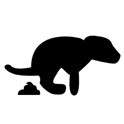

## Daily "Doodies"

- Before any breaks (including smoke breaks):

    - Chalkboard food/beer menus updated (86'd items crossed off, stuff that's back on displayed)

    - Old flyers/posters removed from doors, windows, etc.

    - ALL "Open" signs on/off

    - Dishes put away

    - Ashtrays emptied

    - doublecheck the shopping list

- Throughout the day and as needed:

    - Kitchen prep: pan crusts, chop veg, prep meats & sauces, etc.

    - Sweep front

    - Indoor and outdoor tables cleaned and wiped 

    - Spot sweeping and cleaning 

    - Dust Constantly -- The dust comes from the Brewery grains, but the customer doesn’t know that - all they see is “Dirty.”

    - Ashtrays emptied

